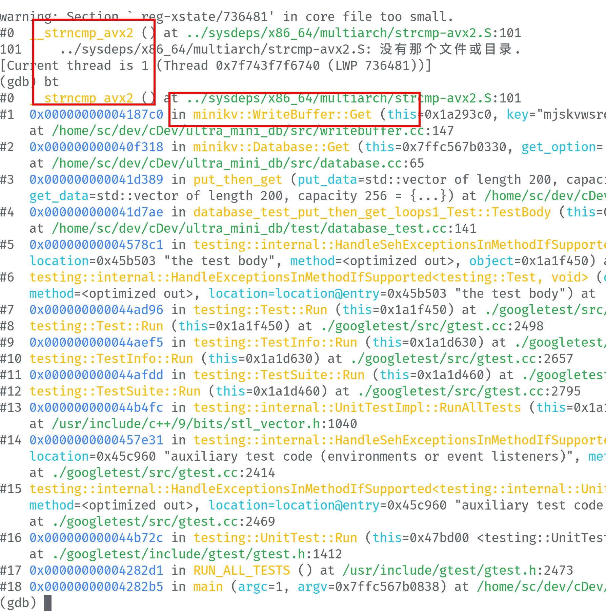

#### put-get的正确性

1. 先put插入数据、然后get查找数据。刚开始都正确。但是当key_size、val_size很小的时候(1、2、3、)测试报错，后面发现是随机生成的短的字符串可能是相同的。但是对于相同的key，查询只能得到最新的val。所以需要正确的函数(gen_test_case)构造测试用例。首先生成put_data，然后根据最新的key得到最新的val。添加到get_data中。
   ```cpp
   void gen_test_case(int loops, int key_size, int val_size,
                   std::vector<std::pair<std::string, std::string>> &put_data,
                   std::vector<std::pair<std::string, std::string>> &get_data);
    // loops=10; key_size=1; val_size=1;               
    gen_test_case(10, 1, 1, put_data, get_data);
   ```
   
   > 生成的put_data、geta_data正确

   
2. 发现另一个问题：这种情况下minikv得不到正确结果，发现是在`wb`中遍历income_buffer的时候是正向遍历的，改成逆序遍历。
   
   ```cpp
    // 修改遍历income_buffer的顺序
    for (std::size_t i = buffer_len - 1; i >= 0; --i);
   ```
   
   > 通过
3. 发现一个问题，在插入数据比较大的情况下，会出现coredump，然后bt查看fashengcoredump时刻的调用栈，发现应该是`wb`中iterate income的bug。
   
   ```cpp
   // 修改代码，使用迭代器
   for (auto iter = buffer.rbegin(); iter != buffer.rend(); ++iter)
   ```

   ```cpp
   // tes.cc  再次测试，bug暂时解决
    auto loops = 20000;
    gen_test_case(loops, 10, 10, put_data, get_data);
   ```

   > FIXME: 然后继续增加loops(2000000)，又出现了coredump，再次打印bt，这次是encode，decode错误，应该是和mmap的文件大小有关，可能是mmap不够用了（一个猜测。record的key、value的size都是10的话，record size是545B，默认的mmap size是(1<<25)就是32MB，再加上record header等的一些损耗。可能通过插入的记录条数就是6w±。然后测试loops=60000通过，loops=65000就会coredump。再加上coredump的bt，应该就是mmapfilesize的问题。

4. 然后发现另一个问题，在key_size、val_size较小的时候，looops很大，也会出错，这个可能是因为在`se`中的index用的std::multimap<uint64_t, uint64_t>，也是需要逆序遍历的,但是multimap不能呢过逆序遍历。那就只能顺序遍历，每当hashed_key == item.first 都把记录的val读出来，在退出map的遍历的时候，再次判断value的size，有的话返回OKAY、否则NOT_FOUND。
   > option.h中 默认的db_option中key_max_size、val_max_size为256，record大小545，32MB最大就是60000±条记录.
   > 再次测试，当在`se`中 hashed_key相同的时候打印，设置loops=60000，保证不会因为mmap file size而coredump.
   ```cpp
   // test.cc
   auto loops = 60000;
   gen_test_case(loops, 3, 3, put_data, get_data);

   // se.cc
   int flag = 0;
   for (auto iter = range.first; iter != range.second; ++iter) {
      if (iter->first == hashed_key) {
         if (flag > 0) fprintf(stdout, "StorageEngine::Get, [reenter]\n");
         flag++;
         // ...
      }
   }
   ```
   

   > 设置loops=60000，然后分别测试不同的key_size、val_size，通过测试
   
   